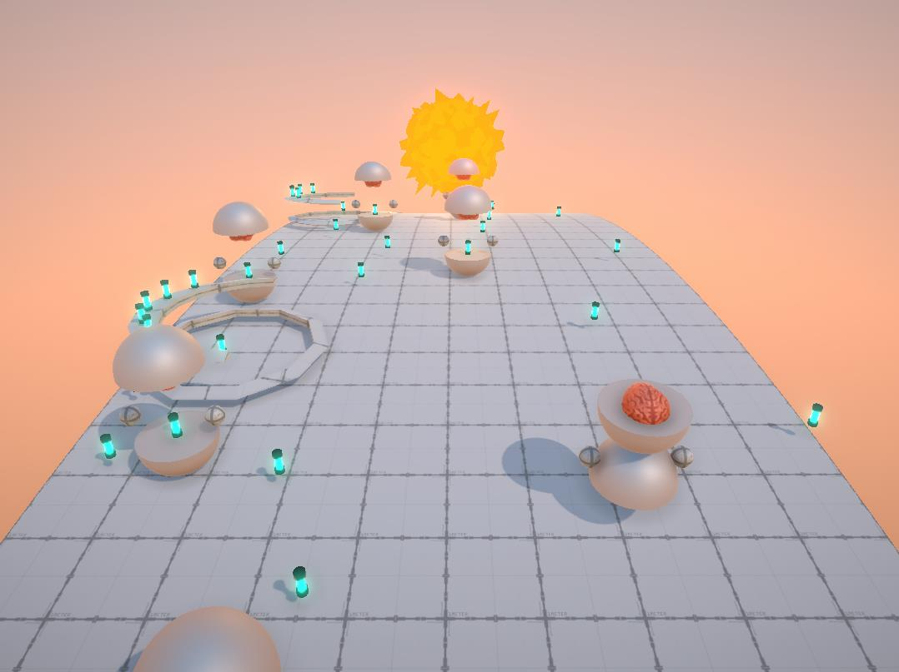

## 

## 游戏介绍

主题灵感来源于：AI训练，逻辑体的艺术创作需要以现有物即认得认知为基础。 

模式灵感来源于之前的一场头脑风暴中：一间供给人类与魔鬼的餐厅，并以时间为分界运营。 

**游戏背景：**一场由意识体主导的思想验证，想让机器化为有意识体的人！ 一方世界中有着一群自动化生成的机器人想要成为人，而不断改造自身不断的与自身的部分有机物进行融合，但不幸的是最终成就了一种诡异的往复平衡。 机器在训练人的感觉而人的部分且在执行机器的逻辑，人的部分习惯黑夜，机器的部分喜欢白天。 机器以人脑思维为目的并不断培养，而构就人的部分却进行反噬，好似在一条无尽又循环的世界中不断进行着AI训练，不断吞噬原本属于人的思想，而造物主却吝啬的将有限的空间构造为当局者无限的囧感。 

**游戏玩法：**在一个类环型带子星体上观察并剔除极端者，保持整个环境的稳态或啥也不干就观察![[妙啊]](readme.assets/b4cb77159d58614a9b787b91b1cd22a81f383535.png@20w_20h.webp)。 使用 Q,E移动视角在星体上的位置(游戏以不同观察位置有不同的时间差来体现这一点)最大偏移一圈(其实应该开放的也懒得注释代码了![[doge]](readme.assets/3087d273a78ccaff4bb1e9972e2ba2a7583c9f11.png@20w_20h.webp))，W,S,A,D 选择观察对象查看具体对象信息，X 销毁该对象。

 **一下为透剧内容：** 

机器人有两种，采集者与拟人者。

 建筑有一种：资源建筑 

1.采集者：负责收集环境中的能源来维持自身的运行，主要的目的为通过劳作掌握意识，其类人脑安置于机器外壳之内。 

2.拟人者：更贴近目的机器人，由采集者进化而来，所以自己认为比采集者更好，就不主动采集资源来维持自身运行而是直接从采集者身体中暴力拿取。拥有半意识状态，并由意识所支配更为强大但还需要能源作为运行基础，当自身能源值过低时会变为采集者，从而放弃思想只为存活，而有些则不会因为他们是半意识者，自己为自己负责。

 3.资源建筑：定时分发资源到环境当中，并只在白天运行，会主动制造新的采集者。 

采集者希望拥有意识而不断的进行努力，而拟人者拥有意识却再疯狂消耗与夺取意识，两种机器人本是同源却异命而生，在走不到头的世界中不断踱步，世界在往复、自身在往复，以至于不知何时而起？